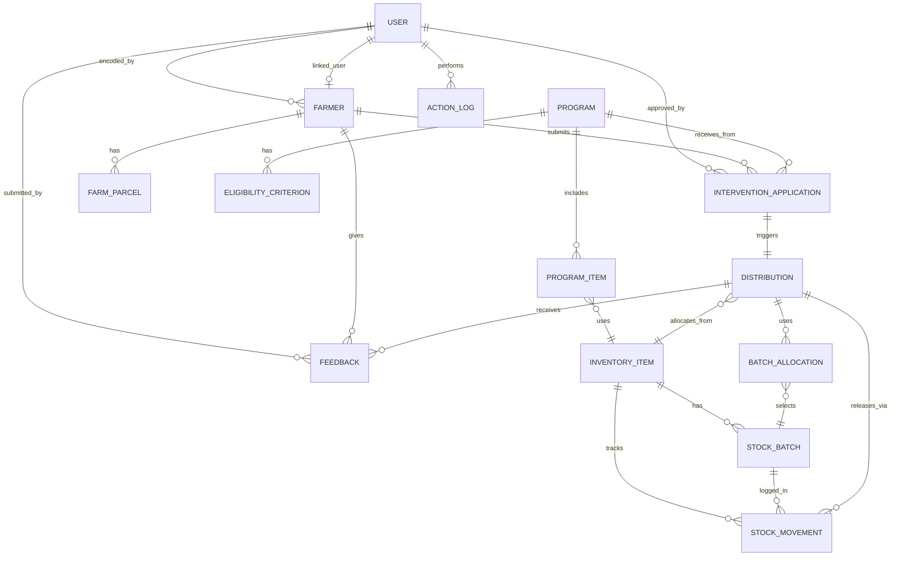

# BATC Entity Relationship Diagram (ERD)

## Conceptual Overview

The BATC system has **20+ models** organized into 11 domain apps. The core entities are:

```
User (ADMIN/STAFF/CLIENT)
  ├─ Farmer (registered beneficiary)
  │   ├─ FarmParcel (land holdings)
  │   ├─ InterventionApplication (applies to programs)
  │   └─ Feedback (rates distributions)
  ├─ Program (intervention offering)
  │   ├─ ProgramItem (what's being distributed)
  │   ├─ EligibilityCriterion (who qualifies)
  │   └─ InventoryItem (linked stock)
  ├─ InventoryItem (seeds, fertilizers, etc.)
  │   ├─ StockBatch (lot number + expiry)
  │   └─ StockMovement (audit ledger)
  ├─ Distribution (delivery promise)
  │   ├─ DistributionItem (qty allocated)
  │   └─ (links to Application + Batch allocation)
  └─ ActionLog (audit trail)
```

---

## Entity-Relationship Listing

### Core Entities

#### **USER** (Custom Django User)
| Field | Type | Constraint | Notes |
|---|---|---|---|
| id | INT | PK | |
| username | VARCHAR(150) | UNIQUE NOT NULL | |
| email | VARCHAR(254) | | |
| password | VARCHAR(128) | NOT NULL | Hashed |
| role | VARCHAR(20) | NOT NULL | Choices: ADMIN, STAFF, CLIENT |
| first_name | VARCHAR(150) | | |
| last_name | VARCHAR(150) | | |
| is_active | BOOLEAN | DEFAULT True | |
| is_archived | BOOLEAN | DEFAULT False | Soft delete |
| archived_at | DATETIME | NULL | |
| created_at | DATETIME | AUTO | |
| updated_at | DATETIME | AUTO | |

**Relationships:**
- ⟷ FARMER (via `linked_user`) — one user can own one farmer profile
- ⟷ FARMER (via `encoded_by`) — one staff can register many farmers
- ⟷ INTERVENTION_APPLICATION (via `approved_by`) — staff approves apps
- ⟷ INTERVENTION_APPLICATION (via `rejected_by`) — staff rejects apps
- ⟷ ACTION_LOG (via `user`) — user performs actions

---

#### **FARMER**
| Field | Type | Constraint | Notes |
|---|---|---|---|
| id | INT | PK | |
| linked_user_id | INT | FK(User) | **FIX #1:** New field for farmer owner |
| encoded_by_id | INT | FK(User) NOT NULL | Who registered this farmer |
| first_name | VARCHAR(100) | NOT NULL | |
| last_name | VARCHAR(100) | NOT NULL | |
| sex | VARCHAR(10) | Choices: M, F, Other | |
| dob | DATE | | |
| civil_status | VARCHAR(20) | Choices: Single, Married, Widowed, Divorced | |
| mobile_number | VARCHAR(20) | UNIQUE NOT NULL | **FIX #15:** Should normalize to E.164 |
| rsbsa_reference | VARCHAR(50) | UNIQUE NULL | Registry reference |
| barangay | VARCHAR(100) | NOT NULL | FK to geo.Barangay (or hardcoded choices) |
| sitio | VARCHAR(100) | | |
| livelihood_type | VARCHAR(100) | | e.g., "Rice farming", "Coconut" |
| farm_area_ha | DECIMAL(8,2) | | Hectares |
| household_size | INT | | |
| is_4ps | BOOLEAN | DEFAULT False | 4Ps beneficiary |
| is_pwd | BOOLEAN | DEFAULT False | Person with disability |
| is_ip | BOOLEAN | DEFAULT False | Indigenous person |
| consent_dpa | BOOLEAN | DEFAULT False | Data Privacy Act consent |
| consent_dpa_at | DATETIME | NULL | When consent given |
| is_archived | BOOLEAN | DEFAULT False | Soft delete |
| archived_at | DATETIME | NULL | |
| created_at | DATETIME | AUTO | |
| updated_at | DATETIME | AUTO | |

**Relationships:**
- ⟷ FARM_PARCEL (1:M) — farmer has many land parcels
- ⟷ INTERVENTION_APPLICATION (1:M) — farmer applies to many programs
- ⟷ FEEDBACK (1:M) — farmer gives multiple feedback
- ⟷ USER (linked_user) — farmer is a client user (optional)
- ⟷ USER (encoded_by) — created by staff/admin

---

#### **FARM_PARCEL**
| Field | Type | Constraint | Notes |
|---|---|---|---|
| id | INT | PK | |
| farmer_id | INT | FK(Farmer) NOT NULL | |
| area_ha | DECIMAL(8,2) | NOT NULL | |
| commodity | VARCHAR(100) | | e.g., "Rice", "Corn" |
| land_type | VARCHAR(50) | | e.g., "Rainfed", "Irrigated" |
| ownership_type | VARCHAR(50) | | e.g., "Owned", "Rented", "Shared" |
| is_archived | BOOLEAN | DEFAULT False | |
| created_at | DATETIME | AUTO | |
| updated_at | DATETIME | AUTO | |

**Relationships:**
- ⟷ FARMER (M:1) — many parcels per farmer

---

### Programs & Inventory

#### **PROGRAM**
| Field | Type | Constraint | Notes |
|---|---|---|---|
| id | INT | PK | |
| name | VARCHAR(200) | NOT NULL | e.g., "Rice Subsidy 2026" |
| description | TEXT | | |
| start_date | DATE | NOT NULL | |
| end_date | DATE | NOT NULL | |
| status | VARCHAR(20) | Choices: DRAFT, ACTIVE, SUSPENDED, COMPLETED | |
| target_barangays | JSON | | List of barangay IDs or names |
| created_by_id | INT | FK(User) | Admin who created |
| is_archived | BOOLEAN | DEFAULT False | |
| created_at | DATETIME | AUTO | |
| updated_at | DATETIME | AUTO | |

**Relationships:**
- ⟷ PROGRAM_ITEM (1:M) — program includes many items
- ⟷ ELIGIBILITY_CRITERION (1:M) — program has many criteria
- ⟷ INTERVENTION_APPLICATION (1:M) — many farmers apply

---

#### **PROGRAM_ITEM**
| Field | Type | Constraint | Notes |
|---|---|---|---|
| id | INT | PK | |
| program_id | INT | FK(Program) NOT NULL | |
| inventory_item_id | INT | FK(InventoryItem) NOT NULL | |
| allocated_qty | DECIMAL(10,2) | NOT NULL | Total qty for program |
| unit | VARCHAR(20) | | e.g., "kg", "bags" |
| created_at | DATETIME | AUTO | |
| updated_at | DATETIME | AUTO | |

**Relationships:**
- ⟷ PROGRAM (M:1)
- ⟷ INVENTORY_ITEM (M:1)

---

#### **ELIGIBILITY_CRITERION**
| Field | Type | Constraint | Notes |
|---|---|---|---|
| id | INT | PK | |
| program_id | INT | FK(Program) NOT NULL | |
| field_name | VARCHAR(100) | NOT NULL | e.g., "farm_area_ha", "is_4ps" |
| operator | VARCHAR(20) | Choices: EQ, NE, GT, GTE, LT, LTE, IN, IS_TRUE, IS_FALSE | |
| value | VARCHAR(100) | NULL | e.g., "0.5", "True" |
| created_at | DATETIME | AUTO | |
| updated_at | DATETIME | AUTO | |

**Relationships:**
- ⟷ PROGRAM (M:1)

**Note:** **FIX #16** — Add validation: only certain operator+field combinations allowed.

---

#### **INVENTORY_ITEM**
| Field | Type | Constraint | Notes |
|---|---|---|---|
| id | INT | PK | |
| name | VARCHAR(200) | NOT NULL | e.g., "Certified Rice Seeds" |
| description | TEXT | | |
| unit | VARCHAR(20) | NOT NULL | e.g., "kg", "bags" |
| current_qty | DECIMAL(10,2) | NOT NULL | Total available stock |
| low_stock_threshold | DECIMAL(10,2) | | Alert when below this |
| is_archived | BOOLEAN | DEFAULT False | |
| created_at | DATETIME | AUTO | |
| updated_at | DATETIME | AUTO | |

**Relationships:**
- ⟷ STOCK_BATCH (1:M) — item has many batches
- ⟷ STOCK_MOVEMENT (1:M) — item has ledger entries
- ⟷ PROGRAM_ITEM (1:M) — item used in many programs
- ⟷ DISTRIBUTION (M:M via DistributionItem) — item distributed in distributions

---

#### **STOCK_BATCH**
| Field | Type | Constraint | Notes |
|---|---|---|---|
| id | INT | PK | |
| inventory_item_id | INT | FK(InventoryItem) NOT NULL | |
| lot_number | VARCHAR(50) | NOT NULL | **FIX #13:** Should be unique(item, lot) |
| quantity_received | DECIMAL(10,2) | NOT NULL | Original qty |
| current_qty | DECIMAL(10,2) | NOT NULL | After allocations |
| expiry_date | DATE | NULL | NULL = non-perishable |
| received_date | DATE | NOT NULL | |
| received_by_id | INT | FK(User) | Who received batch |
| is_archived | BOOLEAN | DEFAULT False | |
| created_at | DATETIME | AUTO | |

**Relationships:**
- ⟷ INVENTORY_ITEM (M:1)
- ⟷ STOCK_MOVEMENT (1:M)

**Note:** **FIX #12** — Use `F("expiry_date").asc(nulls_last=True)` for FEFO queries.

---

#### **STOCK_MOVEMENT** (Audit Ledger)
| Field | Type | Constraint | Notes |
|---|---|---|---|
| id | INT | PK | |
| inventory_item_id | INT | FK(InventoryItem) NOT NULL | |
| stock_batch_id | INT | FK(StockBatch) NULL | Which batch (if specific) |
| movement_type | VARCHAR(20) | Choices: RECEIVE, ADJUST, RELEASE | |
| qty | DECIMAL(10,2) | NOT NULL | Signed (±) |
| reason | TEXT | | e.g., "Distributed to farmer123" |
| reference_distribution_id | INT | FK(Distribution) NULL | Links to distribution |
| recorded_by_id | INT | FK(User) | Who recorded |
| created_at | DATETIME | AUTO | |

**Relationships:**
- ⟷ INVENTORY_ITEM (M:1)
- ⟷ STOCK_BATCH (M:1)
- ⟷ DISTRIBUTION (M:1)
- ⟷ USER (recorded_by)

---

### Applications & Distribution

#### **INTERVENTION_APPLICATION**
| Field | Type | Constraint | Notes |
|---|---|---|---|
| id | INT | PK | |
| farmer_id | INT | FK(Farmer) NOT NULL | |
| program_id | INT | FK(Program) NOT NULL | **FIX #7:** Partial unique: only (SUBMITTED, UNDER_REVIEW, APPROVED, FULFILLED) |
| status | VARCHAR(20) | Choices: SUBMITTED, UNDER_REVIEW, APPROVED, REJECTED, CANCELLED, FULFILLED | |
| applied_at | DATETIME | AUTO | |
| reviewed_at | DATETIME | NULL | When staff reviewed |
| approved_by_id | INT | FK(User) NULL | Which staff approved |
| rejected_by_id | INT | FK(User) NULL | Which staff rejected |
| rejection_reason | TEXT | NULL | Why rejected |
| cancelled_at | DATETIME | NULL | When cancelled |
| created_at | DATETIME | AUTO | |
| updated_at | DATETIME | AUTO | |

**Relationships:**
- ⟷ FARMER (M:1)
- ⟷ PROGRAM (M:1)
- ⟷ DISTRIBUTION (1:M) — one app can have one distribution (1:1 in practice)
- ⟷ USER (approved_by, rejected_by)

**Note:** **FIX #17** — Wrap `submit_application` in `@transaction.atomic()`.

---

#### **DISTRIBUTION** (6 States)
| Field | Type | Constraint | Notes |
|---|---|---|---|
| id | INT | PK | |
| application_id | INT | FK(InterventionApplication) UNIQUE | One dist per app |
| inventory_item_id | INT | FK(InventoryItem) NOT NULL | What's being distributed |
| qty | DECIMAL(10,2) | NOT NULL | Amount to give farmer |
| status | VARCHAR(20) | Choices: DRAFT, SCHEDULED, DISPATCHED, IN_TRANSIT, DELIVERED, ARCHIVED | |
| scheduled_date | DATE | NULL | Planned pickup/delivery |
| dispatched_at | DATETIME | NULL | When left warehouse |
| in_transit_at | DATETIME | NULL | When in transport |
| delivered_at | DATETIME | NULL | When farmer received |
| created_by_id | INT | FK(User) | Who created distribution |
| confirmed_by_id | INT | FK(User) NULL | Who confirmed receipt (farmer) |
| confirmed_at | DATETIME | NULL | When farmer confirmed |
| is_archived | BOOLEAN | DEFAULT False | |
| created_at | DATETIME | AUTO | |
| updated_at | DATETIME | AUTO | |

**Relationships:**
- ⟷ INTERVENTION_APPLICATION (1:1)
- ⟷ INVENTORY_ITEM (M:1)
- ⟷ BATCH_ALLOCATION (1:M) — distribution allocates from multiple batches (FEFO)
- ⟷ USER (created_by, confirmed_by)

**Critical:** [[wiki/project/decisions/2026-05-12-atomic-distribution.md]] — When status → DELIVERED, atomically allocate + decrement + log + fulfill.

---

#### **BATCH_ALLOCATION**
| Field | Type | Constraint | Notes |
|---|---|---|---|
| id | INT | PK | |
| distribution_id | INT | FK(Distribution) NOT NULL | |
| stock_batch_id | INT | FK(StockBatch) NOT NULL | Which batch allocated |
| qty | DECIMAL(10,2) | NOT NULL | How much from this batch |
| created_at | DATETIME | AUTO | |

**Relationships:**
- ⟷ DISTRIBUTION (M:1) — one dist can use many batches
- ⟷ STOCK_BATCH (M:1)

**Logic:** FEFO order (earliest expiry first); see [[wiki/project/decisions/2026-05-12-fefo-batches.md]].

---

### Cross-Cutting

#### **ACTION_LOG** (Audit Trail)
| Field | Type | Constraint | Notes |
|---|---|---|---|
| id | INT | PK | |
| user_id | INT | FK(User) NOT NULL | Who performed action |
| action | VARCHAR(50) | | e.g., "CREATE", "UPDATE", "APPROVE" |
| object_type | VARCHAR(50) | | e.g., "Farmer", "Application", "Distribution" |
| object_id | INT | | Which record |
| old_value | JSON | NULL | Before state |
| new_value | JSON | NULL | After state |
| timestamp | DATETIME | AUTO | |

**Relationships:**
- ⟷ USER (M:1)

---

#### **ANNOUNCEMENT**
| Field | Type | Constraint | Notes |
|---|---|---|---|
| id | INT | PK | |
| title | VARCHAR(200) | NOT NULL | |
| content | TEXT | NOT NULL | |
| target_roles | JSON | NOT NULL | List: ["ADMIN", "STAFF", "CLIENT"] |
| published_at | DATETIME | NOT NULL | |
| created_by_id | INT | FK(User) NOT NULL | |
| is_archived | BOOLEAN | DEFAULT False | |
| created_at | DATETIME | AUTO | |

**Relationships:**
- ⟷ USER (created_by)

---

#### **FEEDBACK**
| Field | Type | Constraint | Notes |
|---|---|---|---|
| id | INT | PK | |
| farmer_id | INT | FK(Farmer) NOT NULL | **FIX #8:** Should check role == CLIENT |
| distribution_id | INT | FK(Distribution) NULL | Which distribution (optional) |
| rating | INT | NOT NULL | 1–5 |
| comment | TEXT | | |
| status | VARCHAR(20) | Choices: NEW, ACKNOWLEDGED, RESOLVED | |
| submitted_at | DATETIME | AUTO | |
| created_at | DATETIME | AUTO | |

**Relationships:**
- ⟷ FARMER (M:1)
- ⟷ DISTRIBUTION (M:1)

---

#### **NOTIFICATION**
| Field | Type | Constraint | Notes |
|---|---|---|---|
| id | INT | PK | |
| recipient_id | INT | FK(User) NOT NULL | Who gets notified |
| type | VARCHAR(50) | | e.g., "APP_APPROVED", "DIST_SCHEDULED" |
| title | VARCHAR(200) | | |
| message | TEXT | | |
| payload | JSON | NULL | Context data |
| read_at | DATETIME | NULL | |
| created_at | DATETIME | AUTO | |

**Relationships:**
- ⟷ USER (recipient)

---

## Key Constraints & Rules

| Rule | Enforcement | Reference |
|---|---|---|
| Farmer can only re-apply after REJECTED/CANCELLED | Partial unique index | **FIX #7** |
| Batch (item, lot) unique | Unique constraint | **FIX #13** |
| FEFO allocation mandatory | FEFO logic in selectors.py | [[2026-05-12-fefo-batches.md]] |
| Distribution delivery atomic | @transaction.atomic() | [[2026-05-12-atomic-distribution.md]] |
| Role-based access | @permission_classes decorators | [[2026-05-12-rbac.md]] |
| Soft deletes only | is_archived + archived_at | [[architecture-rules.md]] |

---

## Database Diagram (Mermaid)



---

**Updated:** 2026-05-12  
**Critical Fixes Needed:** See [[known-bugs-and-issues.md]] issues #1, #7, #8, #12, #13, #15, #16, #17
